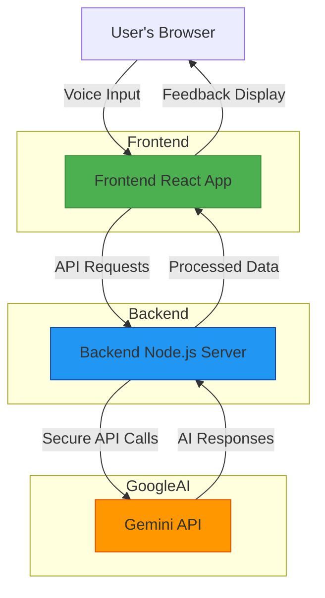

# System Architecture

## Component Overview

### Frontend (React/Vite)
- **Location**: User's browser
- **Responsibilities**:
  - User interface rendering
  - Voice recording and playback
  - WebSocket connections for real-time communication
  - State management for conversation flow
  - Displaying AI feedback reports

### Backend (Node.js/Express)
- **Location**: Server environment (Render, Railway, etc.)
- **Responsibilities**:
  - Securely storing API keys
  - Proxying requests to Gemini API
  - Handling CORS for cross-origin requests
  - Rate limiting and security measures
  - Processing and formatting AI responses

### Gemini API
- **Location**: Google's servers
- **Responsibilities**:
  - Natural language processing
  - Conversation generation
  - Feedback analysis and scoring
  - Speech-to-text (if used)

## Data Flow

1. **User Interaction**: User speaks into microphone
2. **Frontend Processing**: Browser captures audio and sends to backend
3. **Backend Proxy**: Securely forwards request to Gemini API with server-side key
4. **AI Processing**: Gemini processes request and generates response
5. **Response Handling**: Backend receives and formats response
6. **Frontend Display**: User sees AI response in conversation interface
7. **Feedback Generation**: After session, detailed feedback is generated
8. **Report Display**: User views comprehensive feedback report

## Security Features

- **API Key Protection**: Keys stored only on backend, never exposed to frontend
- **CORS Configuration**: Restricts which origins can access the backend
- **HTTPS Communication**: All API calls use secure connections
- **Input Validation**: Backend validates all incoming requests
- **Rate Limiting**: Prevents abuse of API resources

## Scalability Considerations

- **Stateless Backend**: Can be scaled horizontally
- **Caching**: Frequently used responses can be cached
- **Load Balancing**: Multiple backend instances can be load balanced
- **Database Integration**: For storing user progress and session history